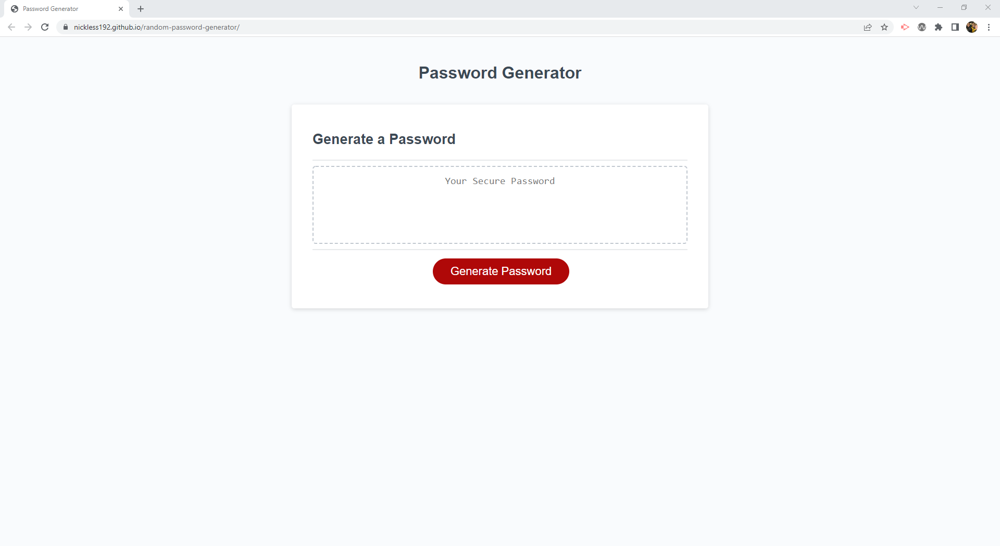
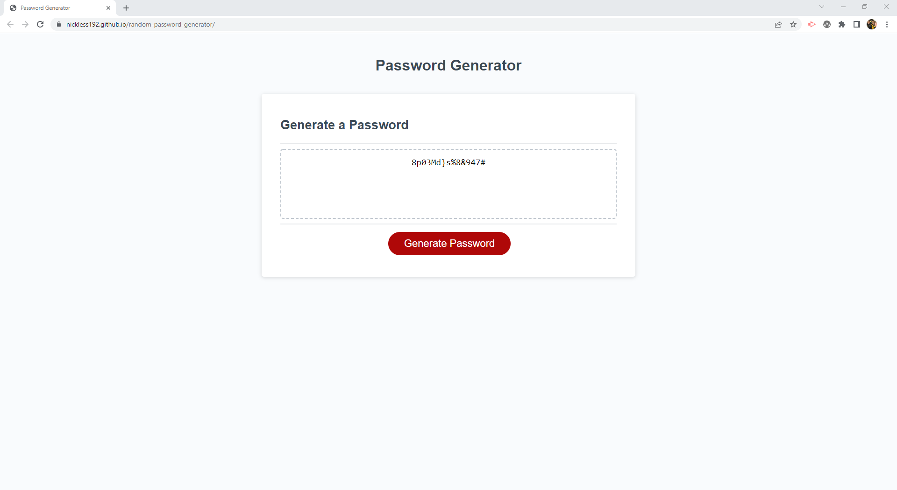

# Password Generator Starter Code

## Description

Our Random Password Generator will generate a new password for our users after pressing the "Generate Password" button. This triggers a series of prompts to be displayed to the user. The user will need to confirm if the new password will include:

* Lowercase characters
* Uppercase characters
* Numeric characters
* Special characters

Upon responding to these 4 prompts, then the tool will show prompts confirming the chosen criteria. If no character types are included, then the program will alert the user that at least one criteria should be selected, and the user will be prompted again to make their selections. Once this condition is satisfied, then the user will be prompted to select the password length, which should be between 8 and 128 characters. If the desired length is not within these parameters, the user will be prompted again until a valid answer is provided. Once all prompts are answered, then the password generator starts working: it will loop through the different character type lists and select a random character from the list. This random character is then appended to a string, initially blank, until the full password is generated.

Halfway through this process, the generator will perform a check: based on which character types the user requested to include in the password, it will determine if any of them is still pending to be included in the password. If any of them is still not included, it will force to randomly choose a character from these missing character types to append to the password. For instance, if the user wants to have numbers but halfway through there are no numbers included yet, then a random number is chosen and added to the password. This check is only performed **once** through the password generation process.

Once the generated password is of the desired length, then it is shown to the user as a window alert and then it is written to the website. If a new password is needed, just push the button :smile:

## User Story

AS AN employee with access to sensitive data 
I WANT to randomly generate a password that meets certain criteria 
SO THAT I can create a strong password that provides greater security 

## Acceptance Criteria

GIVEN I need a new, secure password 
WHEN I click the button to generate a password 
THEN I am presented with a series of prompts for password criteria 
WHEN prompted for password criteria 
THEN I select which criteria to include in the password 
WHEN prompted for the length of the password 
THEN I choose a length of at least 8 characters and no more than 128 characters 
WHEN asked for character types to include in the password 
THEN I confirm whether or not to include lowercase, uppercase, numeric, and/or special characters 
WHEN I answer each prompt 
THEN my input should be validated and at least one character type should be selected 
WHEN all prompts are answered 
THEN a password is generated that matches the selected criteria 
WHEN the password is generated 
THEN the password is either displayed in an alert or written to the page 

## Screenshot of Deployed Site
 

 

## Links

GitHub link: https://github.com/nickless192/random-password-generator

Deployed Page: https://nickless192.github.io/random-password-generator/

## Contributors

Made with ❤️ by Nickless192 (Omar Rodriguez)